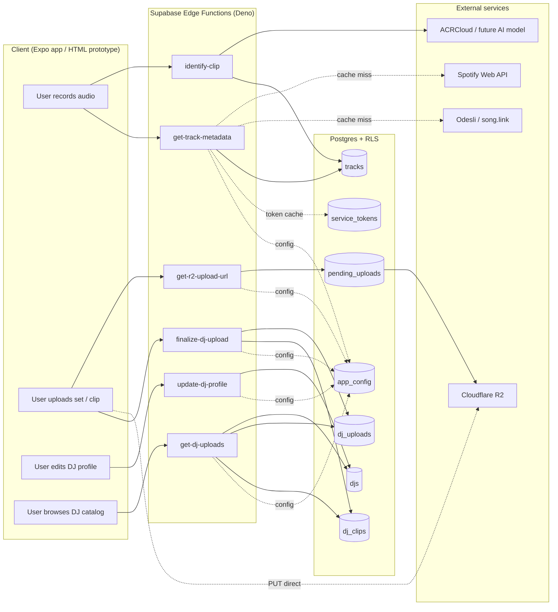
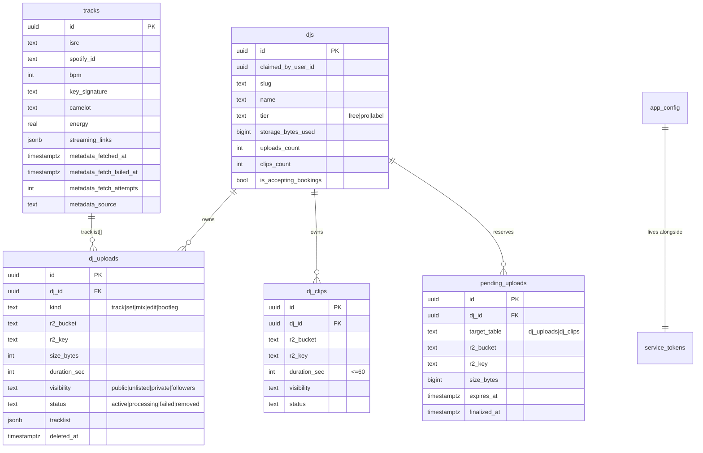
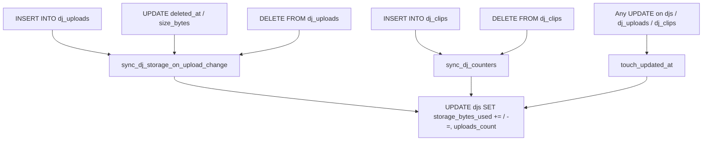
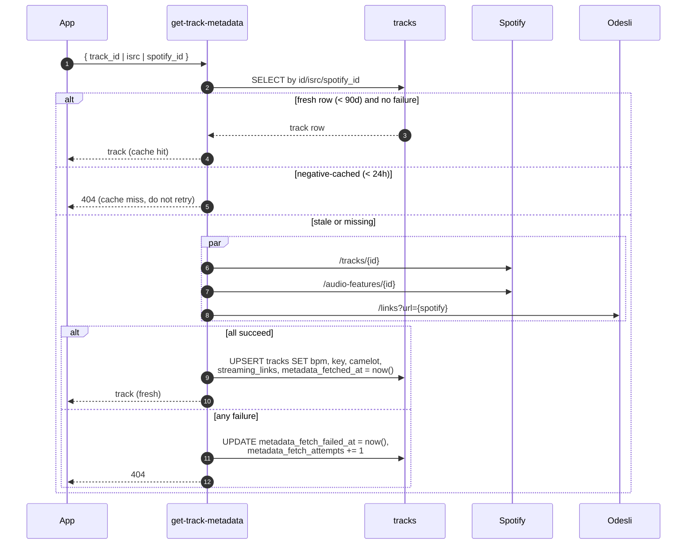
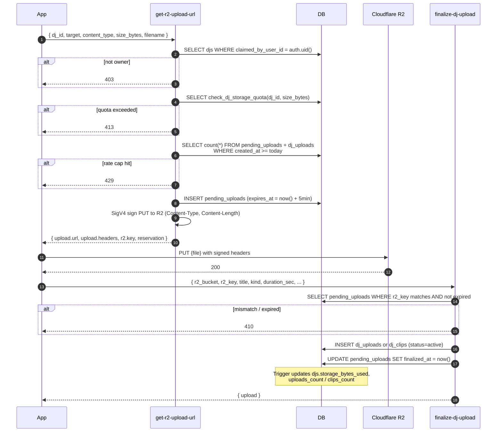
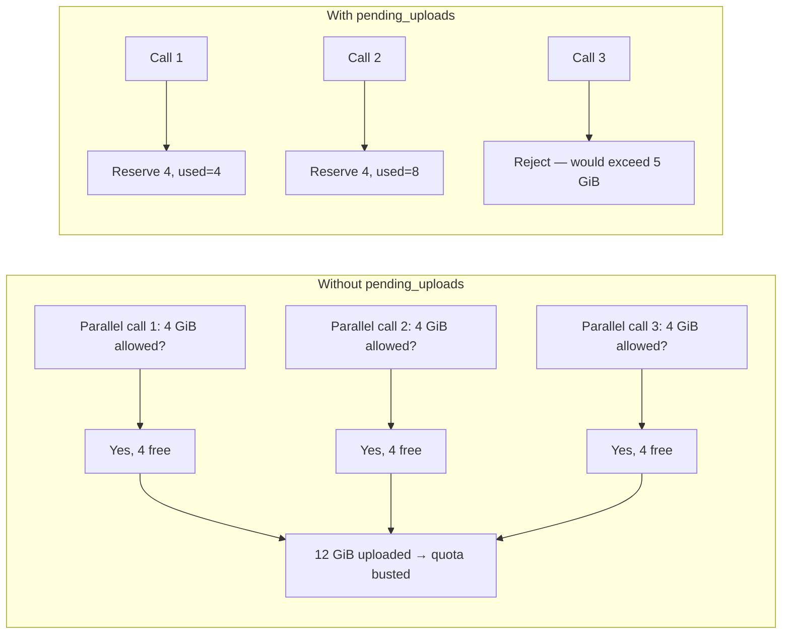
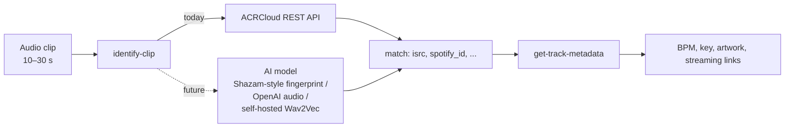

# Tracklist — Backend Architecture

Living document for the Supabase + Cloudflare R2 backend that powers
track metadata enrichment, DJ profiles, audio uploads, and video clips.
Pair with `supabase/functions/DJ_METADATA_DEPLOY.md` for the deploy
runbook.

---

## 1 · System overview



Two design principles drive everything:

1. **Zero Supabase egress for media** — files PUT/GET directly against
   Cloudflare R2 via presigned URLs and a CDN custom domain. Supabase
   only handles JSON.
2. **Cache aggressively, fail negatively** — Spotify / Odesli responses
   are written into `tracks` and reused for 90 days; failed lookups are
   pinned for 24 h via `metadata_fetch_failed_at` so we don't hammer
   APIs for tracks that will never resolve.

---

## 2 · Data model



### Triggers and bookkeeping



`storage_bytes_used`, `uploads_count`, `clips_count`, and `updated_at`
are never written by application code — triggers maintain them so the
counters can't drift from the source of truth.

---

## 3 · Track metadata flow



**Cost ceiling.** Spotify is called at most once per `(spotify_id, 90d)`.
Odesli is unauthenticated and free. A user identifying the same song
twice in the same week never touches an external API.

---

## 4 · DJ upload flow (audio or video)



### Quota reservation — why it matters



The reservation row is consumed when `finalize-dj-upload` succeeds, or
swept by `cleanup_expired_pending_uploads()` (pg_cron, hourly) if the
client never finishes the PUT.

---

## 5 · Auth + RLS posture

```mermaid
flowchart TD
  call[Edge function call] --> svc[getServiceClient<br/>service_role JWT]
  svc --> bypass[RLS bypassed for trusted writes]

  read[Direct PostgREST read from app] --> anon[anon JWT]
  anon --> rls[RLS enforced]
  rls --> pub[Public-readable rows only:<br/>visibility=public AND status=active AND deleted_at IS NULL]
  rls --> own[Owner-editable rows:<br/>claimed_by_user_id = auth.uid]

  call --> ownerCheck["Owner verification inside the function:<br/>SELECT djs.claimed_by_user_id == user.id"]
```

- **Service-role client** is used inside edge functions so triggers and
  cross-table updates work uniformly. Each function re-checks ownership
  in code before any mutation.
- **Anon clients** going through PostgREST hit RLS directly — they can
  only read public rows, never write DJ content.
- **Sensitive fields** (`storage_bytes_used`, `tier`, `booking_email`)
  are stripped server-side in `get-dj-uploads` for non-owners.

---

## 6 · Cost model (current defaults)

| Lever | Default | Knob |
|---|---|---|
| Spotify metadata refresh | 90 d | `track_metadata_refresh_days` |
| Negative cache | 24 h | `track_metadata_negative_ttl_hours` |
| Free tier storage | 5 GiB | `dj_storage_quota_bytes_free` |
| Pro tier storage | 100 GiB | `dj_storage_quota_bytes_pro` |
| Label tier storage | 1 TiB | `dj_storage_quota_bytes_label` |
| Audio upload cap | 250 MiB | `dj_upload_max_size_bytes` |
| Video clip cap | 25 MiB / 60 s | `dj_clip_max_size_bytes` / `dj_clip_max_duration_sec` |
| Daily uploads / DJ | 20 | `dj_upload_rate_per_day` |
| Presigned URL TTL | 5 min | (constant in `_shared/r2.ts`) |

All knobs live in `app_config` and can be tuned with one SQL update —
no redeploy.

---

## 7 · Music recognition — pluggable layer

Today: **ACRCloud** (`identify-clip` edge function). Tomorrow: any
model that takes audio → `{ isrc?, spotify_id?, title, artists }`.



To swap the recognizer, only `identify-clip` changes. Every downstream
function (`get-track-metadata`, the UI) consumes the same
`{ track_id | isrc | spotify_id }` contract. Candidates:

- **AudD** — paid, works like ACRCloud, simpler API.
- **OpenAI Whisper + audio embeddings** — for *vocals*, not full
  fingerprint matching. Useful as a fallback when fingerprint fails.
- **Self-hosted Olaf / Panako** — open-source acoustic fingerprinting
  if you want zero per-call cost at the price of running a worker.
- **Shazam (RapidAPI proxy)** — unofficial but cheap and accurate;
  contractual risk.

The cleanest migration path: keep ACRCloud as primary, add a fallback
chain in `identify-clip` that tries the new model on ACR misses and
records which engine produced the match in `tracks.metadata_source`.

---

## 8 · File map

```
supabase/
├── migrations/
│   ├── 20260421_track_metadata_and_dj_content.sql   ← schema
│   └── _manual/point_r2_to_dev_domains.sql          ← one-shot config
├── functions/
│   ├── _shared/
│   │   ├── spotify.ts          token cache + audio-features mapping
│   │   ├── r2.ts               pure-Deno SigV4 presigner
│   │   ├── auth.ts             requireAuth / getOptionalUser
│   │   ├── errors.ts           typed Errors.* + errorResponse
│   │   ├── validation.ts       parseBody, requireUUID, optionalEnum, …
│   │   ├── cors.ts             corsResponse + headers
│   │   └── logging.ts          createLogger
│   ├── identify-clip/          (existing — ACRCloud)
│   ├── get-track-metadata/     cache-first metadata enrichment
│   ├── get-r2-upload-url/      presigned PUT + quota reservation
│   ├── finalize-dj-upload/     reservation → dj_uploads / dj_clips row
│   ├── update-dj-profile/      whitelisted DJ profile patch
│   ├── get-dj-uploads/         paginated public/owner DJ feed
│   └── DJ_METADATA_DEPLOY.md   deploy runbook
docs/
└── BACKEND_ARCHITECTURE.md     ← this file
```

---

## 9 · Operational checklist

- **Cleanup job** — `cleanup_expired_pending_uploads()` on pg_cron
  hourly. Drops dead reservations so quota frees up.
- **Spotify token** — refreshed by `get-track-metadata` on demand,
  cached in `service_tokens` table (60 min TTL).
- **R2 buckets** — `tracklist-dj-uploads`, `tracklist-dj-clips`. CORS
  pre-set for PUT/GET/HEAD from any origin (PUTs are gated by SigV4,
  not CORS).
- **CDN domains** — `app_config.r2_public_domain_uploads` and
  `r2_public_domain_clips`. Either Cloudflare custom domains
  (`uploads.tracklist.app`, `clips.tracklist.app`) or the auto-issued
  `pub-xxxxxxxx.r2.dev` hostnames.

---

## 10 · Diagrams render where?

This file uses [Mermaid](https://mermaid.js.org/) code blocks. They
render natively on:

- GitHub (web) — every `mermaid` fence becomes an SVG.
- VS Code with the *Markdown Preview Mermaid Support* extension.
- Obsidian, Notion (via paste-as-Mermaid), most modern wikis.

If you ever need static images (slide deck, PDF), copy the fenced
block into <https://mermaid.live> and export SVG/PNG.
