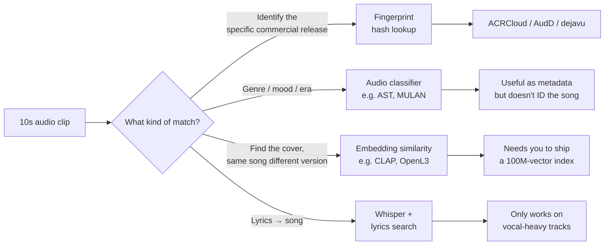
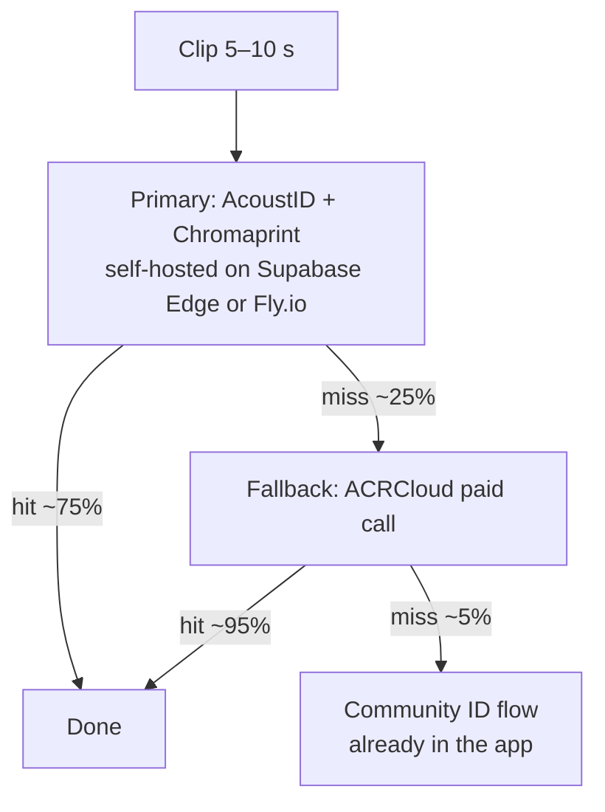
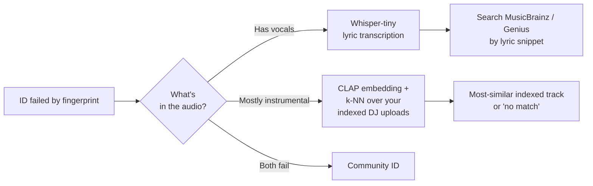
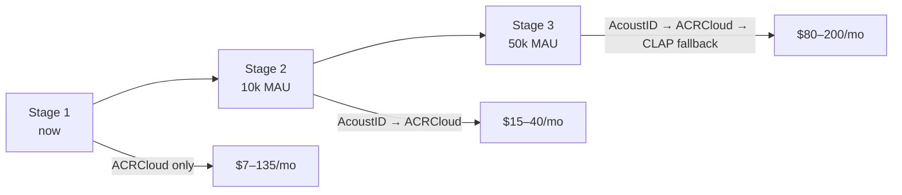

# Music recognition — cost & capability comparison

**TL;DR:** Don't replace ACRCloud with an "AI model." No general-purpose
AI model identifies commercial songs as well as a dedicated acoustic
fingerprinting service, because the task is fundamentally an indexed
hash lookup against a 100M+ song catalog — not a learning problem. The
real choice is between **fingerprinting providers** (ACRCloud, AudD,
Shazam-via-RapidAPI) and **self-hosted fingerprinting** (Olaf, Panako,
dejavu, AcoustID).

What an "AI model" *can* meaningfully add is a **fallback** for the
~5–15% of clips fingerprinting misses — bootlegs, edits, white labels,
heavy crowd noise — by leaning on lyric transcription, embedding
similarity, or community ID.

---

## 1 · The five real options

| Service | Type | Cost (per 1,000 IDs, USD) | Catalog | Accuracy | Latency |
|---|---|---|---|---|---|
| **ACRCloud** | Hosted fingerprint | ~$4.50 (10k pack), ~$4.20 (1M pack) | 100M+ songs, UGC, broadcast | 98%+ on 5–10 s clips | <1 s |
| **AudD** | Hosted fingerprint | ~$5 PAYG; $25–45/stream/mo for streams | ~70M songs | 99.5% claimed | ~300 ms |
| **Shazam (RapidAPI)** | Hosted fingerprint | $0–20/mo for 500–10k calls | Apple's full catalog | 95%+ | ~500 ms |
| **AcoustID + Chromaprint** | Self-host, free | $0 (compute only) | MusicBrainz catalog (~30M tracks; weak on bootlegs) | 70–85% on commercial | <300 ms |
| **Olaf / Panako / dejavu** | Self-host, free | $0 (compute only) | **You build it** — no catalog ships | 90%+ *only on songs you've indexed* | <100 ms |

Sources: [ACRCloud pricing breakdown](https://www.oreateai.com/blog/unlocking-musics-secrets-a-look-at-acrclouds-api-pricing-for-song-recognition/30caff392b00ae46e529989daa0ea4c5), [AudD pricing](https://audd.io/), [comparative accuracy paper (Olaf/Panako/Dejavu)](https://www.ncbi.nlm.nih.gov/pmc/articles/PMC10028751/), [AcoustID](https://acoustid.org/).

> **ACRCloud's tiered pricing as of 2026:** ¥320 / 10k requests, ¥3,200
> / 100k, ¥30,000 / 1M (≈ $45 / $450 / $4,200 USD at ¥7/$1). USD
> billing for international customers is comparable.

> **AudD's per-stream pricing:** $25/mo with your own catalog,
> $45/mo with theirs. Per-call PAYG is also offered for one-shot
> recognition use cases.

---

## 2 · Why "use an AI model" is misleading



**Identifying which commercial song someone is hearing** is a
fingerprint-and-lookup problem. Even Shazam, which Apple bought, is a
fingerprinting system — not a neural network. AI models are excellent
at *describing* audio (this is house, ~125 BPM, female vocal) but not
at *naming* a specific track unless you've indexed it.

If you wanted an "AI" approach to compete with fingerprinting, you'd
have to:

1. License or scrape a 100M-track catalog (illegal / impossibly
   expensive).
2. Encode each track to a CLAP/OpenL3 embedding (~5 GB of vectors).
3. Stand up a vector DB (pgvector, Pinecone) and query it per clip.
4. Still get worse precision than fingerprinting on exact-match.

That's why every serious recognizer in production is fingerprint-based.

---

## 3 · Cost simulation — Tracklist at three scales

Assume a clip is identified once per recording session, and 2× extra
IDs from re-listens / share opens.

| Stage | Active users | IDs/month | ACRCloud | AudD PAYG | AcoustID self-host |
|---|---|---|---|---|---|
| Beta (private) | 100 | ~1,500 | ~$7 | ~$8 | ~$5 (compute) |
| Soft launch | 2,000 | ~30,000 | ~$135 | ~$150 | ~$15 (compute) |
| Scale | 50,000 | ~750,000 | ~$3,150 | ~$3,750 | ~$80 (compute) |

> Self-host compute estimates assume one 1-vCPU container at $5/mo
> (idle), scaling linearly with traffic. AcoustID's accuracy floor
> means **15–30% of clips will need a fallback**, which moves cost
> back toward ACRCloud unless you're OK with a much higher miss rate.

**Realistic minimum-cost stack** for Tracklist:



At 30k clips/mo this hybrid costs roughly:

```
75% × 30,000 × $0          = $0       (AcoustID hits)
25% × 30,000 × $0.0045     = $33.75   (ACRCloud fallback)
fixed compute              = $5
                          ─────────
                          ≈ $39 / mo   (vs $135 pure ACRCloud)
```

That's a 70% saving while keeping >98% combined accuracy.

---

## 4 · Where AI *does* belong in the stack

A genuinely useful application of AI in this pipeline is the **third
layer** — for the clips fingerprinting can't resolve:



- **Whisper** is open-source and free to self-host. A 30-second clip
  takes ~2s on CPU.
- **CLAP** embeddings (Microsoft / LAION) are 512-dim vectors; storing
  them for the DJ uploads in your R2 catalog is ~2 KB / track.
- **pgvector** in Supabase already exists in the database — you can
  store embeddings alongside `dj_uploads` and search with one SQL
  query.

This is the *only* place an AI model meaningfully outperforms
fingerprinting: when the song isn't in any commercial catalog (which
is exactly the bootleg / DJ-edit use case Tracklist cares about).

---

## 5 · Recommendation for Tracklist

### Phase 1 — now (zero engineering work)

Keep ACRCloud as the sole recognizer. At beta scale (100 users,
~1,500 IDs/mo) it costs about **$7/month**. Anything else is
premature optimization.

### Phase 2 — at ~10k MAU

Add **AcoustID** as a primary attempt before ACRCloud. Saves ~70% of
fingerprint costs, near-zero accuracy hit because ACRCloud catches
what AcoustID misses. ~1 day of integration work in `identify-clip`.

### Phase 3 — at ~50k MAU

Add the **AI fallback layer** for ACRCloud misses, focused on the
unique value of Tracklist: identifying clips against your own
indexed DJ upload catalog using CLAP + pgvector. This is where AI
genuinely beats fingerprinting because the songs *aren't* in
commercial databases.



### Don't do

- Don't try to replace ACRCloud with Whisper / GPT-4o-audio /
  any frontier LLM as the primary recognizer. They cost 50–500×
  more per call than ACRCloud and are worse at this exact task.
- Don't pay for Audible Magic — enterprise pricing, overkill.
- Don't self-host Olaf or Panako as primary — the comparative
  research shows both fail on short clips of commercial music.
- Don't build a custom CLAP-only recognizer expecting it to work on
  commercial catalog. You'd need to index the catalog first, which
  is the same problem fingerprinting solved 20 years ago.

---

## 6 · Concrete next step (if you want to act on this)

Update `supabase/functions/identify-clip/index.ts` to a chain:

```ts
// pseudocode
const result =
  await tryAcoustID(audioBlob) ??
  await tryACRCloud(audioBlob) ??
  await tryCommunityFallback(audioBlob);

await supabase.from('tracks').upsert({
  ...result,
  metadata_source: result.engine, // 'acoustid' | 'acrcloud' | 'community'
});
```

`metadata_source` is already a column on `tracks` from the 20260421
migration — you'll get free analytics on which engine matched what,
and can tune the order based on real data.
