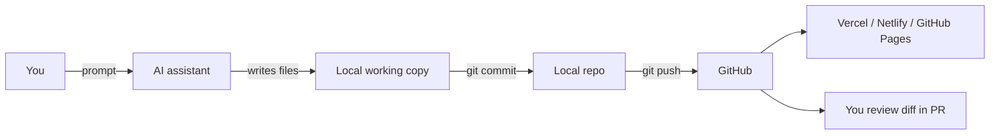

# Working with AI assistants on this repo

Quick reference for using Claude, ChatGPT, Cursor, Aider, Codex, etc.
to make changes — and seeing them rendered in real time.

## 1 · The "AI pushes to GitHub" workflow



Yes — any AI that has shell or file-edit access on your machine can
commit and push. Concrete options:

| Tool | Lives where | Pushes how |
|---|---|---|
| **Claude Code** (this CLI) | Local terminal | Has `Bash` tool → runs `git push` |
| **Cursor** | Local IDE | "Apply" diff → use built-in source-control panel |
| **Aider** | Local CLI | Auto-commits every change (`aider --auto-commits`) |
| **GitHub Copilot Workspace** | Browser | Generates a PR branch directly |
| **Codex / ChatGPT canvas** | Browser, no shell | You copy-paste → commit yourself |

### Minimum-trust setup

If you let multiple AIs touch the repo, keep them on **branches and PRs**
rather than pushing to `master`:

```bash
# Create a branch per AI session
git checkout -b ai/feature-name
# work, commit, push
git push -u origin ai/feature-name
# open PR on GitHub, merge after review
```

Set GitHub branch protection on `master`:
- Require pull request reviews
- Require status checks (CI lint/typecheck)
- Disallow force pushes

That way no single AI can clobber main.

### Secrets hygiene

Never paste service-role keys, R2 credentials, or Spotify secrets into
a prompt. They belong in:
- `supabase secrets set` (Edge Function env)
- `.env.local` (gitignored, local Expo dev)
- GitHub Actions repo secrets (CI)

Rotate anything that has been pasted into a chat. Already on the
to-do list: rotate the R2 + Spotify creds shared earlier.

---

## 2 · Live preview options

### A. The HTML prototype (`designs/prototype/`)

Already running locally:

```bash
npx http-server designs/prototype -p 8765 -c-1
```

For sharing with others or viewing on your phone:

| Option | When |
|---|---|
| `npx http-server -p 8765 --host 0.0.0.0` + your LAN IP | Phone on same wifi |
| `ngrok http 8765` | Public URL, anyone, instant |
| `cloudflared tunnel --url http://localhost:8765` | Same idea, no signup |
| Push to GitHub → enable **GitHub Pages** on `/designs/prototype` | Permanent public URL |
| Drop the folder on **Vercel** / **Netlify** / **Cloudflare Pages** | Auto-redeploy on every push |

Recommended: Cloudflare Pages connected to the repo. Every push to
`master` redeploys; PRs get a unique preview URL.

### B. The Expo app (when you start building it)

```bash
npx expo start
```

- Press `w` → opens in browser (web preview).
- Scan the QR with **Expo Go** on your phone → live device preview
  with hot reload.
- `npx expo start --tunnel` → works across networks if local LAN is
  flaky.

For shareable preview builds without TestFlight:
- **Expo EAS Update** — push JS-only changes to a channel, testers see
  them inside Expo Go or a dev build.
- **EAS Build** with internal distribution — actual `.ipa` / `.apk`
  delivered via a link.

### C. The Supabase backend

Edge Functions don't need a "preview" — they're called over HTTPS by
the app. To exercise them locally:

```bash
supabase functions serve get-track-metadata --env-file .env.local
curl -X POST http://localhost:54321/functions/v1/get-track-metadata \
  -H "Content-Type: application/json" \
  -d '{"spotify_id":"4iV5W9uYEdYUVa79Axb7Rh"}'
```

Logs stream live in the terminal. Set `LOG_LEVEL=debug` for verbose
output.

---

## 3 · Briefing a new AI on this repo

Paste this into the new AI's first message so it doesn't waste turns
re-discovering the codebase:

> This is the Tracklist repo — Letterboxd for live electronic music sets.
> Stack: Expo (React Native + Tamagui — not yet built), HTML/CSS/JS
> prototype at `designs/prototype/`, Supabase backend with
> Postgres + Edge Functions (Deno), Cloudflare R2 for media.
>
> Key docs:
> - `docs/BACKEND_ARCHITECTURE.md` — schema, flows, RLS, cost levers
> - `supabase/functions/DJ_METADATA_DEPLOY.md` — deploy runbook
> - `designs/prototype/` — runnable prototype, port for design changes
>
> Conventions:
> - Edge functions live in `supabase/functions/<name>/index.ts`,
>   share helpers from `_shared/`.
> - Migrations in `supabase/migrations/<YYYYMMDD>_<name>.sql`.
> - Prototype uses vanilla CSS + a single `app.js` router.
> - Buttons use the liquid-glass `.btn-primary` style (CSS-only port
>   of a Tailwind/shadcn LiquidButton).
>
> When committing, branch off `master` as `ai/<topic>` and open a PR.
